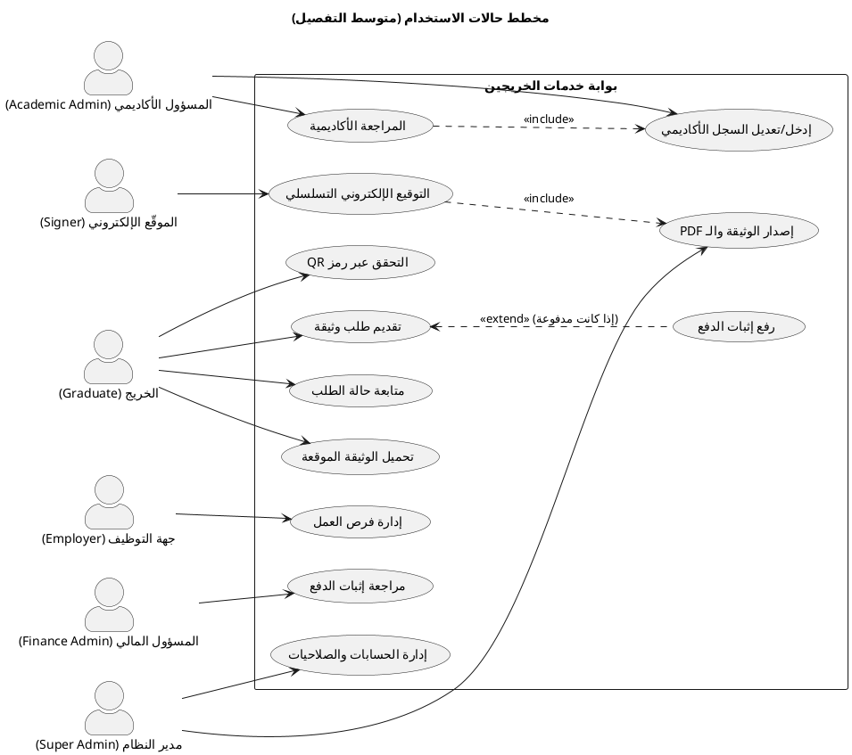
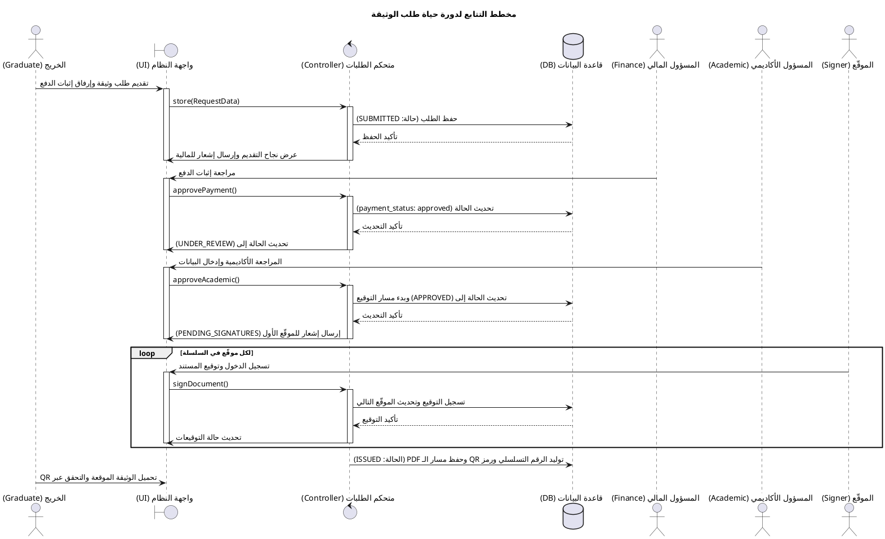
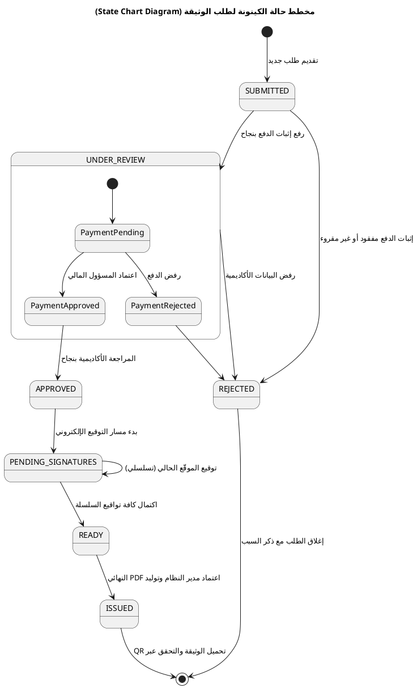
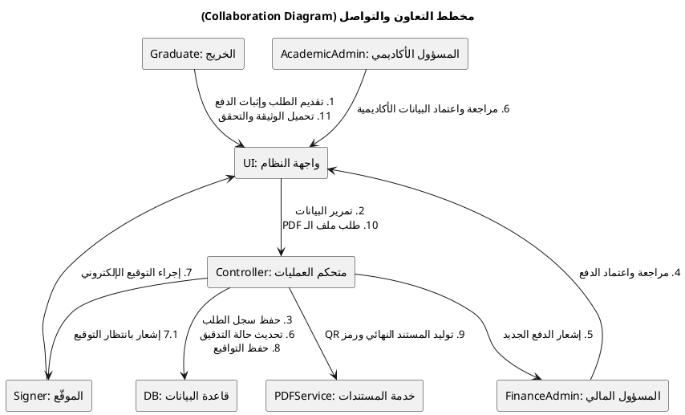
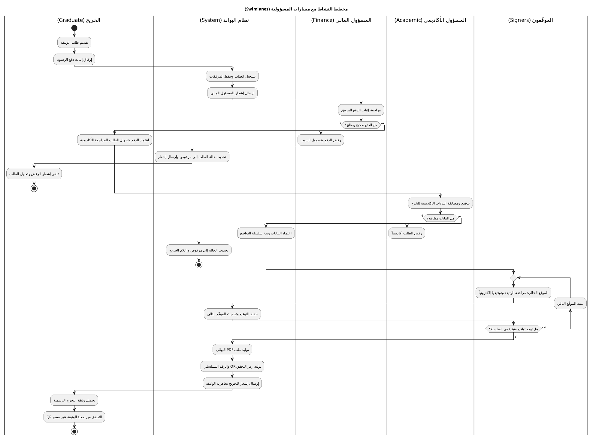
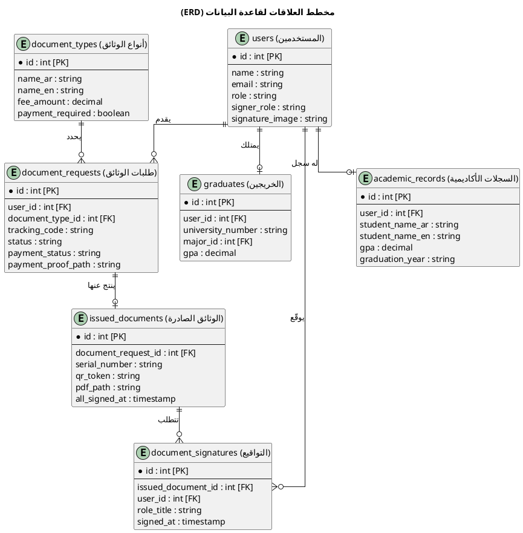
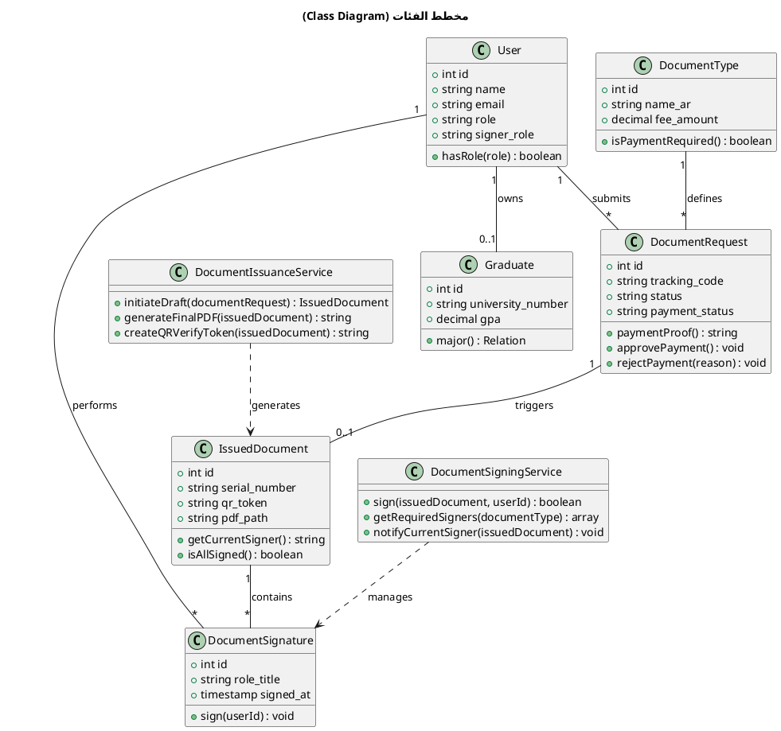

# مخططات UML لبوابة خدمات الخريجين باستخدام PlantText (مستوى متوسط)

يحتوي هذا الملف على مخططات UML الأساسية لنظام **بوابة خدمات الخريجين - جامعة إقليم سبأ** بمستوى تفصيل متوسط (لا طويل ومعقد، ولا بسيط ومختصر)، مكتوبة بلغة **PlantUML** وجاهزة تماماً للاستخدام على موقع **PlantText** للتوثيق ومناقشة مشروع التخرج.

---

## 1. مخطط حالات الاستخدام (Use Case Diagram)

يوضح هذا المخطط الفاعلين الرئيسيين في النظام، حالات الاستخدام، وعلاقات الاشتمال والامتداد دون تعقيد زائد.



---

## 2. مخطط التتابع (Sequence Diagram)

يوضح التفاعلات وتدفق البيانات الزمني بين الأطراف الفاعلة والنظام لإتمام مراحل طلب الوثيقة حتى توليد ملف الـ PDF.



---

## 3. مخطط حالة الكينونة (State Chart Diagram)

يوضح الحالات المختلفة التي يمر بها سجل الطلب داخل قاعدة البيانات والانتقالات المحكومة بالعمليات المالية والأكاديمية والتواقيع.



---

## 4. مخطط التعاون والتواصل (Collaboration Diagram)

يوضح العلاقات والرسائل المتبادلة بين كائنات النظام الأساسية مع ترقيمها لتوضيح تسلسل التفاعل.



---

## 5. مخطط النشاط مع مسارات المسؤولية (Activity Diagram with Swimlanes)

يقسم المهام والأنشطة والمسؤوليات بناءً على دور كل مستخدم ونظام البوابة بشكل متسلسل وعامودي.



---

## 6. مخطط العلاقات لقاعدة البيانات (ERD)

يوضح تصميم الجداول الرئيسية مع تحديد المفاتيح الأساسية (PK) والمفاتيح الأجنبية (FK) ونوع العلاقة بين الجداول.



---

## 7. مخطط الفئات (Class Diagram)

يوضح الفئات والنماذج البرمجية، بالإضافة للخدمات (Services) الرئيسية مع أهم الخصائص والدوال المساعدة والعلاقات بينها.



---

## 8. مواصفات حالات الاستخدام (Use Case Specifications)

توضح الجداول التالية التفاصيل التحليلية لحالات الاستخدام الأربعة الرئيسية في النظام.

### أ. تقديم طلب وثيقة (Submit Document Request)
| البند | التفاصيل |
| :--- | :--- |
| **الفاعل الرئيسي** | الخريج (Graduate) |
| **الوصف** | يقدم الخريج طلباً لوثيقة جديدة ويرفع صورة إثبات الرسوم. |
| **الشروط المسبقة** | وجود سجل أكاديمي مسبق للخريج في قاعدة البيانات. |
| **التدفق الرئيسي** | 1. يختار الخريج نوع الوثيقة واللغة وغرض التقديم.<br>2. يتحقق النظام من وجود بياناته الأكاديمية.<br>3. يرفع الخريج سند الدفع المالي ويؤكد الطلب.<br>4. يتم حفظ الطلب بحالة `SUBMITTED` وتنبيه المسؤول المالي. |
| **التدفق البديل** | إذا كانت الوثيقة مجانية، يتجاوز النظام خطوة رفع سند الدفع وتتحول الحالة إلى `APPROVED` لبدء المراجعة الأكاديمية مباشرة. |

### ب. مراجعة إثبات الدفع (Review Payment Proof)
| البند | التفاصيل |
| :--- | :--- |
| **الفاعل الرئيسي** | المسؤول المالي (Finance Admin) |
| **الوصف** | مراجعة واعتماد أو رفض سندات الدفع المرفقة بالطلبات. |
| **الشروط المسبقة** | أن يكون الطلب بحالة `SUBMITTED` وحالة الدفع `pending_review`. |
| **التدفق الرئيسي** | 1. يستعرض المسؤول المالي سند الدفع المرفق بالطلب.<br>2. يطابق السند مع حساب الجامعة البنكي.<br>3. يعتمد الدفع فتتغير حالة الدفع إلى `approved` وحالة الطلب إلى `UNDER_REVIEW`. |
| **التدفق البديل** | في حال عدم وضوح السند أو خطئه، يتم رفض الدفع مع إدخال السبب وإشعار الخريج لرفع سند جديد. |

### ج. المراجعة الأكاديمية (Academic Review)
| البند | التفاصيل |
| :--- | :--- |
| **الفاعل الرئيسي** | المسؤول الأكاديمي (Academic Admin) |
| **الوصف** | مطابقة بيانات ودرجات الخريج مع الكشوفات الورقية قبل التواقيع. |
| **الشروط المسبقة** | اعتماد الطلب مالياً وأن تكون حالته `UNDER_REVIEW`. |
| **التدفق الرئيسي** | 1. يراجع المدقق الأكاديمي درجات الخريج ومعدله التراكمي.<br>2. يعتمد البيانات أكاديمياً.<br>3. ينشئ النظام مسودة الوثيقة في جدول `issued_documents` وتتحول حالة الطلب لـ `APPROVED`. |
| **التدفق البديل** | إذا وجد المدقق خطأ في الدرجات، يتم رفض الطلب مع ذكر السبب وإعلام الخريج. |

### د. التوقيع الإلكتروني التسلسلي (Sequential Signing)
| البند | التفاصيل |
| :--- | :--- |
| **الفاعل الرئيسي** | الموقّعون (Signers - عميد، مسجل، إلخ حسب نوع الوثيقة) |
| **الوصف** | توقيع الوثيقة إلكترونياً بالتسلسل حسب الترتيب المحدد لكل نوع وثيقة. |
| **الشروط المسبقة** | أن تكون حالة الطلب `PENDING_SIGNATURES` ويكون الدور على الموقّع الحالي. |
| **التدفق الرئيسي** | 1. يراجع الموقّع الحالي بيانات الوثيقة الجاهزة.<br>2. يوقع إلكترونياً فيقوم النظام بحفظ التوقيع وتنبيه الموقّع التالي في الترتيب. |
| **التدفق البديل** | عند توقيع آخر مسؤول في السلسلة، يتم تحديث حقل `all_signed_at` وتتحول حالة الطلب تلقائياً إلى `READY` تمهيداً للإصدار النهائي. |
```
