# مخططات Mermaid لبوابة خدمات الخريجين
**Graduation Services Portal - Saba Region University**

يحتوي هذا الملف على كافة مخططات UML الخاصة بالنظام الفعلي لبوابة خدمات الخريجين بجامعة إقليم سبأ، مكتوبة بلغة Mermaid ومجهزة للعرض المباشر في GitHub أو المواقع الداعمة لـ Mermaid مثل [Mermaid Live Editor](https://mermaid.live/).

---

## 1. مخطط حالات الاستخدام (Use Case Diagram)
### عنوان المخطط: مخطط حالات الاستخدام لنظام بوابة خدمات الخريجين
يوضح هذا المخطط الفاعلين الفعليين في النظام وحالات الاستخدام الخاصة بكل منهم مع علاقات التضمين والتمديد.

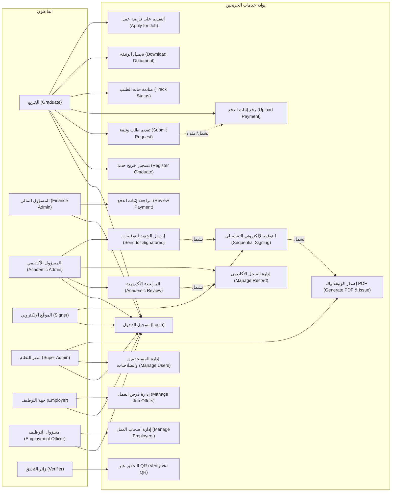

---

## 2. مخطط التتابع: تقديم طلب وثيقة ورفع إثبات الدفع (Sequence Diagram 1)
### عنوان المخطط: مخطط التتابع لتقديم طلب وثيقة ورفع إثبات الدفع

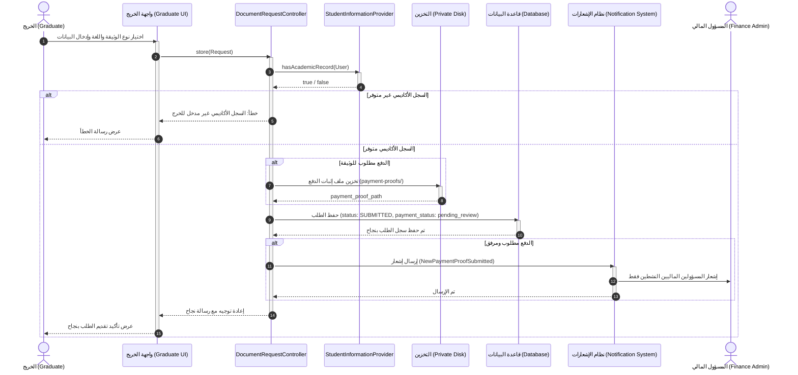

---

## 3. مخطط التتابع: مراجعة المالية (Sequence Diagram 2)
### عنوان المخطط: مخطط التتابع لمراجعة إثبات الدفع

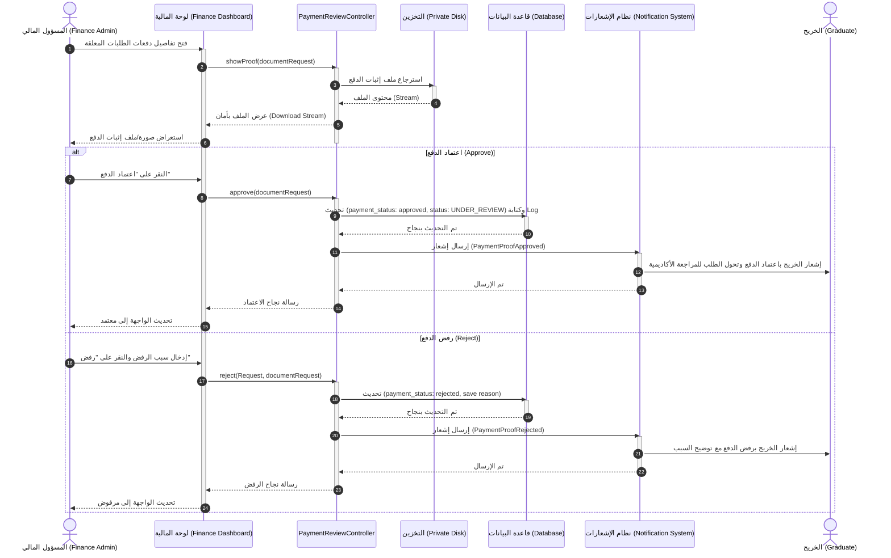

---

## 4. مخطط التتابع: المراجعة الأكاديمية وتجهيز الوثيقة (Sequence Diagram 3)
### عنوان المخطط: مخطط التتابع للمراجعة الأكاديمية وتجهيز الوثيقة

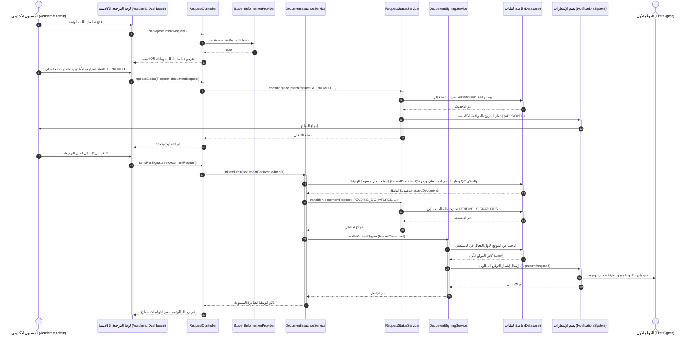

---

## 5. مخطط التتابع: التوقيع الإلكتروني التسلسلي (Sequence Diagram 4)
### عنوان المخطط: مخطط التتابع للتوقيع الإلكتروني التسلسلي

```mermaid
sequenceDiagram
    autonumber
    actor Signer as الموقّع الحالي (Current Signer)
    participant UI as واجهة التوقيعات المعلقة (Signatures UI)
    participant Controller as SignatureController
    participant SigningService as DocumentSigningService
    participant DocModel as IssuedDocument (Model)
    participant DB as قاعدة البيانات (Database)
    participant IssuanceService as DocumentIssuanceService
    participant StatusService as RequestStatusService
    participant Notif as نظام الإشعارات (Notification System)
    actor NextSigner as الموقّع التالي (Next Signer)
    actor Graduate as الخريج (Graduate)

    Signer->>UI: استعراض الوثائق بانتظار توقيعي
    activate UI
    UI->>Controller: pendingSignatures(Request)
    activate Controller
    Controller->>SigningService: getPendingForUser(User)
    activate SigningService
    SigningService->>DocModel: getCurrentSigner()
    activate DocModel
    DocModel-->>SigningService: الموقّع الحالي المطلوب
    deactivate DocModel
    SigningService-->>Controller: قائمة الوثائق الخاصة بدور المستخدم الحالي
    deactivate SigningService
    Controller-->>UI: عرض جدول الوثائق المعلقة للتوقيع
    deactivate Controller

    Signer->>UI: النقر على زر "توقيع المستند"
    UI->>Controller: signDocument(Request, issuedDocument)
    activate Controller
    Controller->>SigningService: sign(User, issuedDocument, roleTitle, ip)
    activate SigningService

    alt غير مصرح له أو ليس دوره في التسلسل الحالي
        SigningService-->>Controller: استثناء: ليس دورك الحالي للتوقيع
        Controller-->>UI: عرض رسالة خطأ
    else مصرح له وهو دوره في التسلسل
        SigningService->>DB: transaction { create DocumentSignature }
        activate DB
        DB-->>SigningService: تم الحفظ والتوقيع
        deactivate DB
        
        SigningService->>SigningService: finalizeIfComplete(issuedDocument)
        activate SigningService
        
        alt يتبقى موقّعون آخرون في السلسلة
            SigningService-->>SigningService: لا يتم توليد الـ PDF بعد
            deactivate SigningService
            SigningService->>SigningService: notifyCurrentSigner(issuedDocument)
            activate SigningService
            SigningService->>DB: البحث عن المستخدمين بالدور التالي
            activate DB
            DB-->>SigningService: الموقّعون التاليون (Users)
            deactivate DB
            SigningService->>Notif: إرسال إشعار التوقيع المطلوب (SignatureRequired)
            activate Notif
            Notif->>NextSigner: إشعار الموقّع التالي بوجود طلب يتطلب توقيعه
            Notif-->>SigningService: تم
            deactivate Notif
            deactivate SigningService
        else اكتملت جميع التوقيعات (التوقيع الأخير)
            SigningService->>IssuanceService: finalizePdf(issuedDocument)
            activate IssuanceService
            IssuanceService->>DB: تحديث مسار الـ PDF وتاريخ الإصدار وتعيين all_signed_at
            activate DB
            DB-->>IssuanceService: تم التحديث
            deactivate DB
            IssuanceService-->>SigningService: تم توليد وحفظ الملف
            deactivate IssuanceService
            deactivate SigningService
            
            SigningService->>StatusService: transition(documentRequest, ISSUED, ...)
            activate StatusService
            StatusService->>DB: تحديث حالة الطلب إلى ISSUED
            activate DB
            DB-->>StatusService: تم التحديث
            deactivate DB
            StatusService->>Notif: إرسال إشعار الخريج بجاهزية الوثيقة (ISSUED)
            activate Notif
            Notif->>Graduate: إرسال إشعار تم إصدار الوثيقة
            Notif-->>StatusService: تم
            deactivate Notif
            StatusService-->>SigningService: تم الانتقال تلقائياً
            deactivate StatusService
        end

        SigningService-->>Controller: كائن التوقيع (DocumentSignature)
        deactivate SigningService
        Controller-->>UI: تم التوقيع بنجاح وتحديث الحالة
        deactivate Controller
        UI-->>Signer: عرض نجاح التوقيع وتحديث الصفحة
        deactivate UI
    end
```

---

## 6. مخطط التتابع: إصدار PDF والتحقق عبر QR (Sequence Diagram 5)
### عنوان المخطط: مخطط التتابع لإصدار الوثيقة والتحقق عبر QR

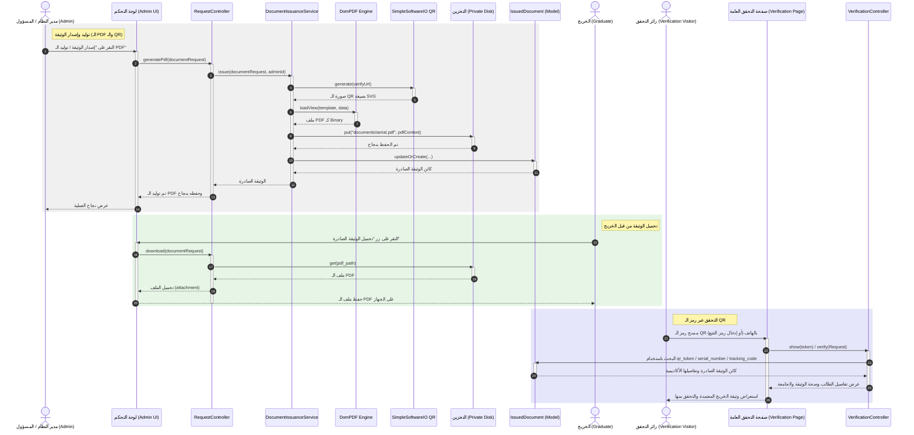

---

## 7. مخطط التعاون (Collaboration Diagram)
### عنوان المخطط: مخطط التعاون بين مكونات النظام

```mermaid
flowchart TD
    %% Objects
    Graduate["1: الخريج (Graduate)"]
    UI["2: واجهة طلب الوثيقة (Request UI)"]
    Controller["3: DocumentRequestController"]
    RequestModel["4: DocumentRequest (Model)"]
    Finance["5: المسؤول المالي (Finance Admin)"]
    Academic["6: المسؤول الأكاديمي (Academic Admin)"]
    Issuance["7: DocumentIssuanceService"]
    IssuedDoc["8: IssuedDocument (Model)"]
    Signers["9: الموقّعون (Signers)"]
    Engines["10: PDF/QR Engine"]

    %% Communications
    Graduate -->|1: تقديم الطلب ورفع الدفع| UI
    UI -->|2: store()| Controller
    Controller -->|3: create(SUBMITTED)| RequestModel
    Controller -.->|4: إشعار بطلب دفع جديد| Finance
    Finance -->|5: approve(اعتماد الدفع وتحول الحالة لـ UNDER_REVIEW)| Controller
    Academic -->|6: updateStatus(APPROVED)| Controller
    Academic -->|7: sendForSignatures(إرسال للتواقيع)| Controller
    Controller -->|8: initiateDraft()| Issuance
    Issuance -->|9: create(مسودة الوثيقة)| IssuedDoc
    Issuance -.->|10: إشعار الموقّع الأول| Signers
    Signers -->|11: signDocument()| Controller
    Controller -->|12: finalizeIfComplete() [التوقيع الأخير]| Issuance
    Issuance -->|13: توليد الـ PDF والـ QR وحفظ الملف| Engines
    Issuance -->|14: updateStatus(ISSUED)| RequestModel
    Controller -.->|15: إشعار بجاهزية الوثيقة| Graduate
```

---

## 8. مخطط الحالة لطلب الوثيقة (State Chart Diagram)
### عنوان المخطط: مخطط حالات طلب الوثيقة

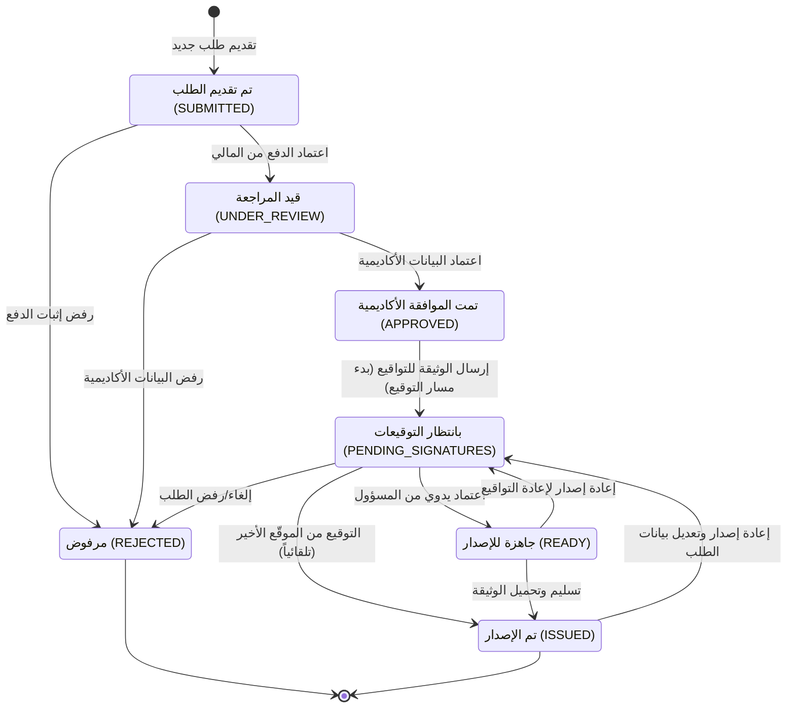

---

## 9. مخطط الأنشطة العام لطلب الوثيقة (Activity Diagram)
### عنوان المخطط: مخطط النشاط العام لطلب الوثيقة

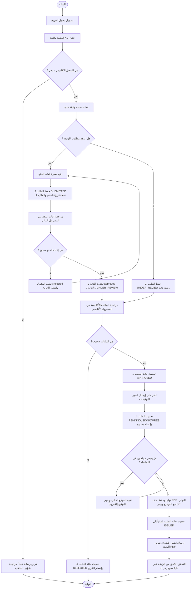

---

## 10. مخطط الأنشطة بالمسارات (Swimlanes Activity Diagram)
### عنوان المخطط: مخطط النشاط بالمسارات لنظام بوابة خدمات الخريجين

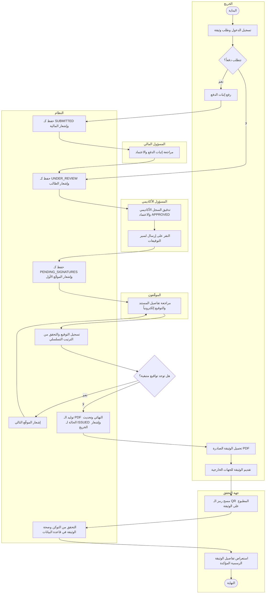

---

## 11. مخطط الطبقات (Layer Diagram)
### عنوان المخطط: مخطط طبقات نظام بوابة خدمات الخريجين

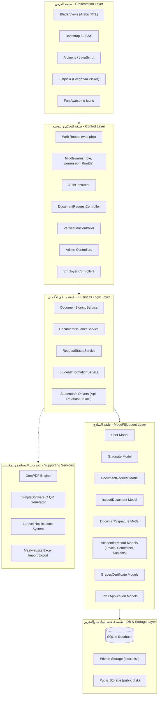

---

## 12. مخطط العلاقات والكيانات (ERD Diagram)
### عنوان المخطط: مخطط الكيانات والعلاقات لقاعدة البيانات

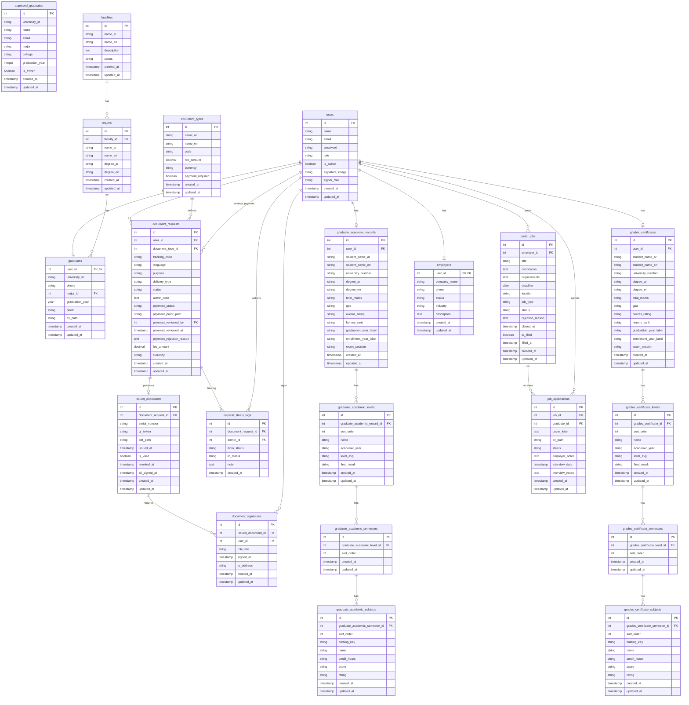

---

## 13. مخطط المكونات (Component Diagram)
### عنوان المخطط: مخطط المكونات لنظام بوابة خدمات الخريجين

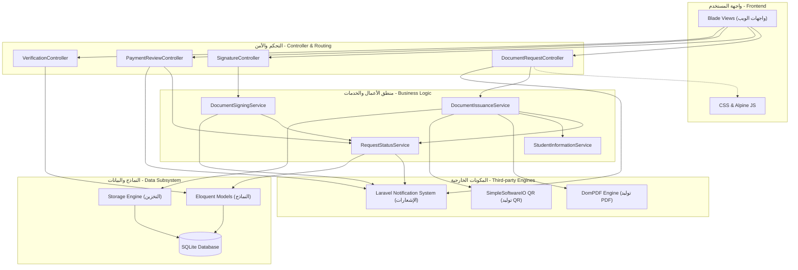

---

## 14. مخطط النشر (Deployment Diagram)
### عنوان المخطط: مخطط النشر لنظام بوابة خدمات الخريجين

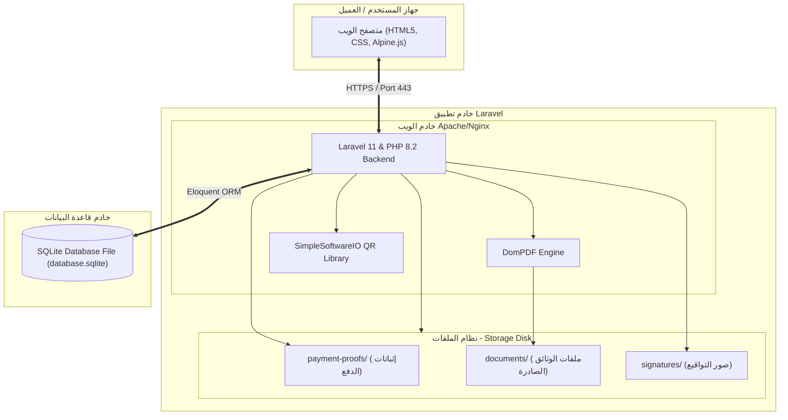
