# مخططات UML لبوابة خدمات الخريجين
**Graduation Services Portal - Saba Region University**

يحتوي هذا الملف على كافة مخططات UML الخاصة بالنظام الفعلي لبوابة خدمات الخريجين بجامعة إقليم سبأ، مكتوبة بلغة PlantUML وجاهزة للنسخ المباشر إلى موقع [PlantText](https://www.planttext.com/).

---

## 1. مخطط حالات الاستخدام (Use Case Diagram)
### عنوان المخطط: مخطط حالات الاستخدام لنظام بوابة خدمات الخريجين
يوضح هذا المخطط الفاعلين الفعليين في النظام (الخريج، المسؤول المالي، المسؤول الأكاديمي، الموقّعون، مدير النظام، جهة التوظيف، زائر التحقق، ومسؤول التوظيف) وحالات الاستخدام لكل منهم مع علاقات الاشتمال والامتداد.

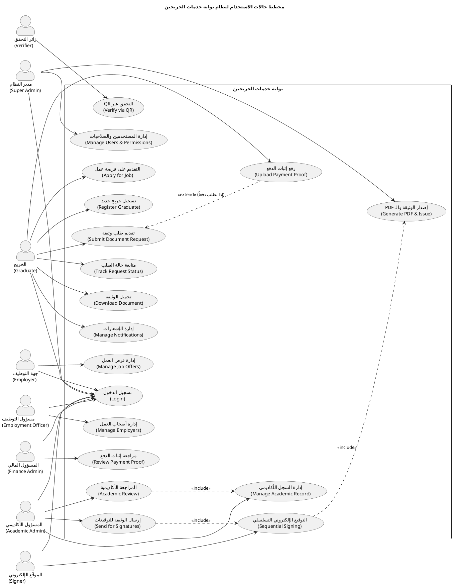

---

## 2. مخطط التتابع: تقديم طلب وثيقة ورفع إثبات الدفع (Sequence Diagram 1)
### عنوان المخطط: مخطط التتابع لتقديم طلب وثيقة ورفع إثبات الدفع
يوضح هذا المخطط التفاعل بين الخريج، والواجهة، والمتحكم، ونظام الملفات، وقاعدة البيانات، ونظام الإشعارات لإتمام تقديم الطلب ورفع إثبات الدفع وإرسال الإشعار للمسؤول المالي فقط.

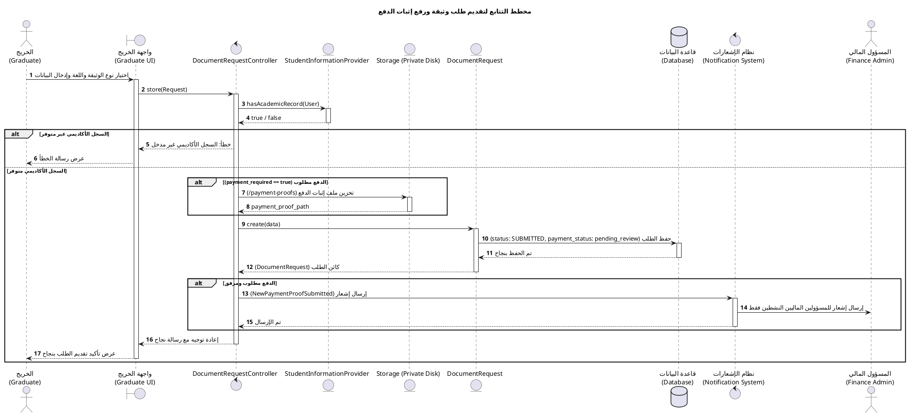

---

## 3. مخطط التتابع: مراجعة المالية (Sequence Diagram 2)
### عنوان المخطط: مخطط التتابع لمراجعة إثبات الدفع
يوضح هذا المخطط قيام المسؤول المالي باستعراض إثبات الدفع (الذي يتم تحميله بأمان من القرص الخاص) واتخاذ قرار بالاعتماد أو الرفض وتحديث البيانات وإشعار الخريج.

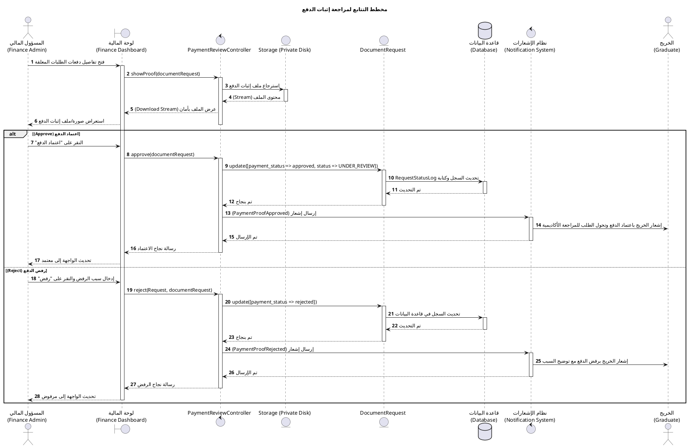

---

## 4. مخطط التتابع: المراجعة الأكاديمية وتجهيز الوثيقة (Sequence Diagram 3)
### عنوان المخطط: مخطط التتابع للمراجعة الأكاديمية وتجهيز الوثيقة
يوضح المخطط قيام المسؤول الأكاديمي بالتحقق من البيانات الأكاديمية للطالب عبر النظام، واعتماد الطلب، ومن ثم إرساله إلى مسار التوقيعات الإلكترونية التسلسلي.

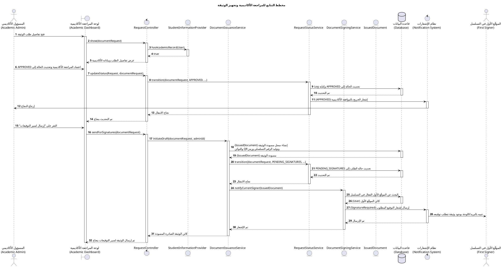

---

## 5. مخطط التتابع: التوقيع الإلكتروني التسلسلي (Sequence Diagram 4)
### عنوان المخطط: مخطط التتابع للتوقيع الإلكتروني التسلسلي
يوضح هذا المخطط قيام الموقّعين بالتوقيع بالتسلسل الصارم، حيث يقوم النظام بالتحقق التلقائي من أن الموقّع هو الموقّع الحالي في الترتيب، وإشعار الموقّع التالي فقط، وتحديث الحالة تلقائياً إلى ISSUED بعد توقيع الموقّع الأخير.

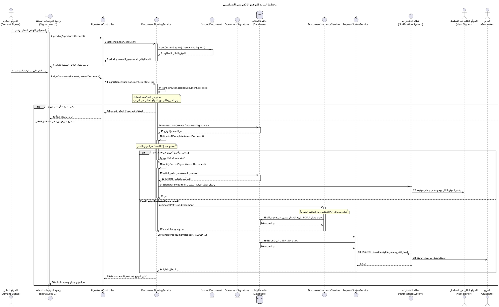

---

## 6. مخطط التتابع: إصدار PDF والتحقق عبر QR (Sequence Diagram 5)
### عنوان المخطط: مخطط التتابع لإصدار الوثيقة والتحقق عبر QR
يوضح هذا المخطط عملية توليد الـ PDF ورمز QR وحفظ الملف في التخزين الآمن وتنزيله من قبل الخريج، والتحقق اللاحق من صحته من قبل جهة خارجية (زائر التحقق) عبر رمز التتبع أو رمز QR.

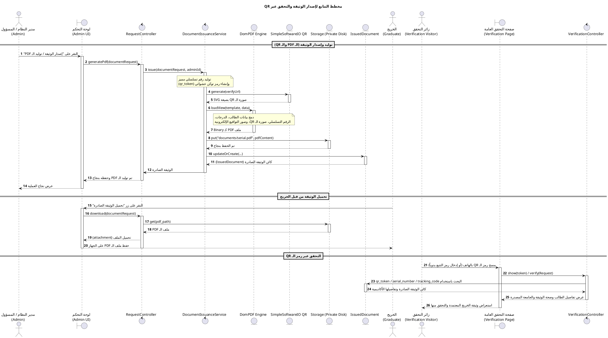

---

## 7. مخطط التعاون (Collaboration Diagram)
### عنوان المخطط: مخطط التعاون بين مكونات النظام
يوضح هذا المخطط التعاون وتدفق الرسائل المرقمة بين المكونات المختلفة في النظام خلال دورة حياة طلب الوثيقة بالكامل.

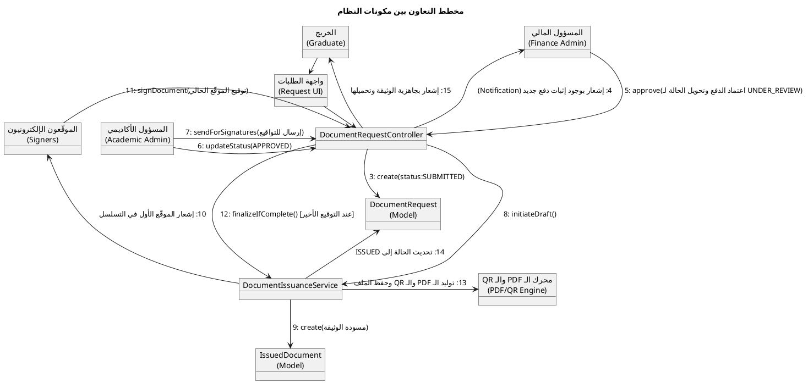

---

## 8. مخطط الحالة لطلب الوثيقة (State Chart Diagram)
### عنوان المخطط: مخطط حالات طلب الوثيقة
يوضح هذا المخطط الحالات الفعلية التي يمر بها طلب الوثيقة في قاعدة البيانات والتحولات المسموحة والقيود المفروضة عليها في الكود الفعلي لـ `RequestStatusService`.

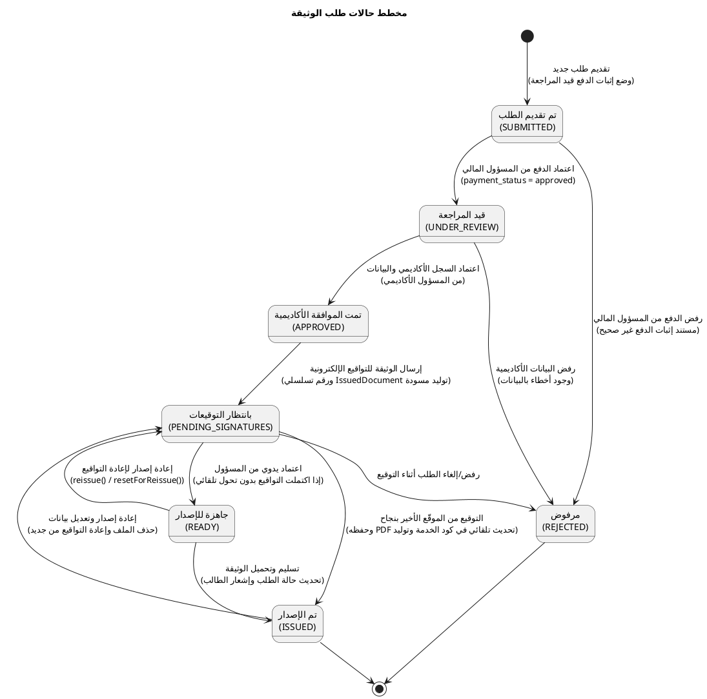

---

## 9. مخطط الأنشطة العام لطلب الوثيقة (Activity Diagram)
### عنوان المخطط: مخطط النشاط العام لطلب الوثيقة
يوضح المخطط تدفق الأنشطة ونقاط اتخاذ القرار من تسجيل دخول الخريج، مروراً بالمراجعة المالية والأكاديمية، ثم التوقيعات وإصدار المستند النهائي بصيغة PDF.

```plantuml
@startuml
title مخطط النشاط العام لطلب الوثيقة

start
:تسجيل دخول الخريج;
:اختيار نوع الوثيقة واللغة والبيانات;
if (هل السجل الأكاديمي مدخل في النظام؟) then (لا)
    :عرض رسالة خطأ (يجب مراجعة شؤون الطلاب);
    stop
else (نعم)
    :إنشاء طلب وثيقة جديد;
    if (هل الدفع مطلوب للوثيقة؟) then (نعم)
        :رفع صورة إثبات الدفع;
        :حفظ الطلب بحالة (SUBMITTED) والمالية بحالة (pending_review);
        :إرسال إشعار للمسؤول المالي;
        :مراجعة إثبات الدفع من المسؤول المالي;
        if (هل إثبات الدفع صحيح وقيمة المبلغ مطابقة؟) then (لا)
            :تحديث حالة الدفع لـ (rejected);
            :إدخال سبب الرفض وإرسال إشعار للخريج;
            :يعدل الخريج إثبات الدفع ويرفعه من جديد;
            backward:رفع صورة إثبات الدفع;
        else (نعم)
            :تحديث حالة الدفع لـ (approved);
            :تحديث حالة الطلب تلقائياً إلى (UNDER_REVIEW);
        end if
    else (لا)
        :حفظ الطلب بحالة (UNDER_REVIEW) والدفع (not_required);
    end if
    
    :مراجعة البيانات الأكاديمية (المسؤول الأكاديمي);
    if (هل البيانات الأكاديمية صحيحة؟) then (لا)
        :تحديث حالة الطلب إلى (REJECTED) وإشعار الخريج;
        stop
    else (نعم)
        :تحديث حالة الطلب إلى (APPROVED);
        :النقر على "إرسال لسير التوقيعات";
        :تحديث حالة الطلب لـ (PENDING_SIGNATURES)\nوإنشاء مسودة وتوليد الرقم التسلسلي والتوكن;
        
        repeat
            :تحديد الموقّع الحالي وإرسال إشعار (SignatureRequired) له;
            :دخول الموقّع وتدقيق الوثيقة وتوقيعها إلكترونياً;
            :حفظ التوقيع وسجل التوقيع (DocumentSignature);
        repeat while (هل يتبقى موقّعون في السلسلة؟) is (نعم) not (لا)
        
        :توليد ملف الـ PDF النهائي ودمج التواقيع إلكترونياً;
        :حفظ الملف في التخزين الآمن (Storage);
        :تحديث حالة الطلب تلقائياً إلى (ISSUED);
        :إرسال إشعار للخريج بصدور الوثيقة;
        :دخول الخريج وتحميل الوثيقة PDF;
        :التحقق اللاحق من الوثيقة عبر مسح رمز الـ QR والتوكن;
    end if
end if
stop
@enduml
```

---

## 10. مخطط الأنشطة بالمسارات (Swimlanes Activity Diagram)
### عنوان المخطط: مخطط النشاط بالمسارات لنظام بوابة خدمات الخريجين
يوضح هذا المخطط توزيع المهام والمسؤوليات بين كافة الفاعلين في النظام (الخريج، النظام، المسؤول المالي، المسؤول الأكاديمي، الموقّعون، مدير النظام، جهة التحقق).

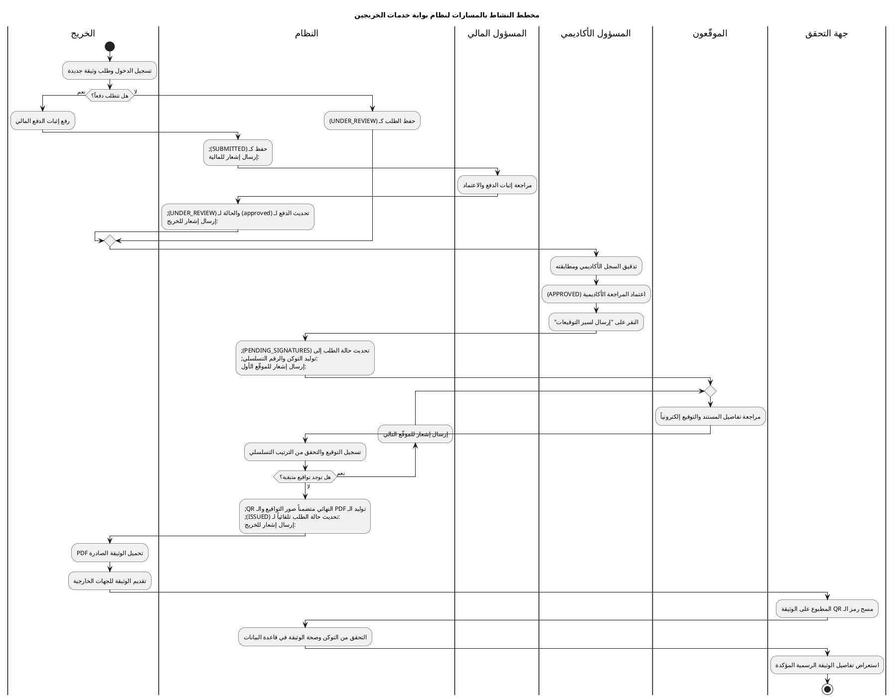

---

## 11. مخطط الطبقات (Layer Diagram)
### عنوان المخطط: مخطط طبقات نظام بوابة خدمات الخريجين
يوضح هذا المخطط بنية النظام وهيكلته الموزعة على طبقات Laravel المختلفة لضمان الفصل التام بين منطق العمل والواجهات وقواعد البيانات.

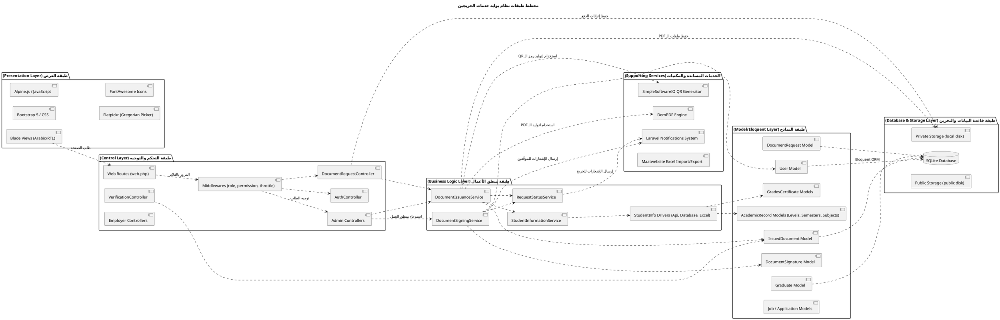

---

## 12. مخطط العلاقات والكيانات (ERD Diagram)
### عنوان المخطط: مخطط الكيانات والعلاقات لقاعدة البيانات
يوضح هذا المخطط البنية الفعلية لجداول قاعدة البيانات والعلاقات بينها بالاعتماد على الهجرات (Migrations) المنفذة في الكود الفعلي للنظام.

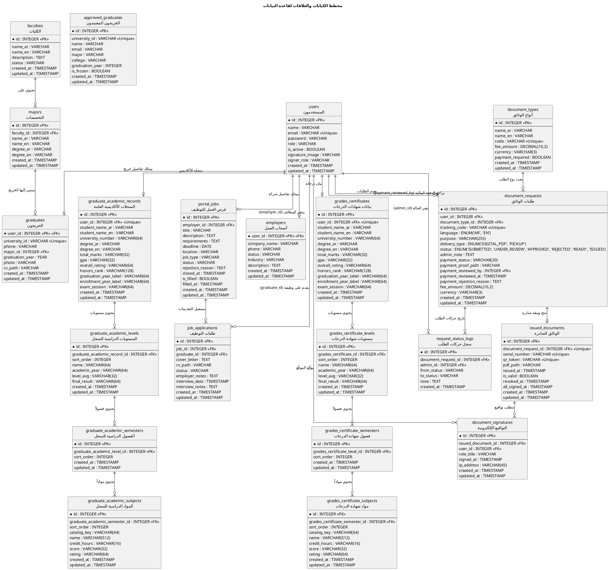

---

## 13. مخطط المكونات (Component Diagram)
### عنوان المخطط: مخطط المكونات لنظام بوابة خدمات الخريجين
يوضح هذا المخطط المكونات المادية لنظام بوابة الخريجين والربط بين واجهات العرض والمحركات الخدمية مثل توليد الـ PDF ورمز QR وقاعدة البيانات.

```plantuml
@startuml
title مخطط المكونات لنظام بوابة خدمات الخريجين

skinparam componentStyle uml2

package "الواجهة الأمامية\n(Frontend Subsystem)" {
    [واجهات الويب والـ Blade]\n(Blade Views) as views
    [تنسيقات التصميم والتحكم الأمامي]\n(CSS & Alpine JS) as styles
}

package "التحكم والأمن\n(Controller & Routing Subsystem)" {
    [متحكم طلبات الوثائق]\n(DocumentRequestController) as req_ctrl
    [متحكم التوقيع الإلكتروني]\n(SignatureController) as sign_ctrl
    [متحكم مراجعة الدفع]\n(PaymentReviewController) as pay_ctrl
    [متحكم التحقق العام]\n(VerificationController) as verify_ctrl
}

package "منطق الأعمال والخدمات\n(Business Logic Services)" {
    [خدمة إصدار الوثائق]\n(DocumentIssuanceService) as issue_srv
    [خدمة التواقيع الإلكترونية]\n(DocumentSigningService) as sign_srv
    [خدمة تتبع وإدارة الحالة]\n(RequestStatusService) as status_srv
    [مزود البيانات الأكاديمية للطلاب]\n(StudentInformationProvider) as student_srv
}

package "النماذج والبيانات\n(Data Subsystem)" {
    [نماذج Eloquent ORM]\n(Models) as models
    database "قاعدة بيانات SQLite"\n(SQLite DB) as db
    [نظام التخزين الخاص والعام]\n(Storage Engine) as storage
}

package "المكونات الخارجية والمكتبات\n(Third-party Engines)" {
    [توليد الـ PDF]\n(DomPDF Library) as dompdf
    [توليد الـ QR Code]\n(SimpleSoftwareIO QR) as qr_gen
    [نظام الإشعارات للبريد واللوحة]\n(Laravel Notification System) as notif
}

' روابط المكونات
views -down-> req_ctrl : "تقديم الطلب ورفع الدفع"
views -down-> sign_ctrl : "توقيع الوثيقة"
views -down-> pay_ctrl : "اعتماد الدفع"
views -down-> verify_ctrl : "التحقق من الوثيقة"

req_ctrl .right.> styles
req_ctrl -down-> issue_srv
req_ctrl -down-> notif
sign_ctrl -down-> sign_srv
pay_ctrl -down-> status_srv
pay_ctrl -down-> notif
verify_ctrl -down-> models

issue_srv -down-> status_srv
issue_srv -down-> student_srv
issue_srv -down-> dompdf
issue_srv -down-> qr_gen
issue_srv -down-> storage

sign_srv -down-> status_srv
sign_srv -down-> notif
status_srv -down-> notif
status_srv -down-> models

models -down-> db : "قراءة/كتابة"
storage -down-> db : "حفظ مسارات الملفات"
@enduml
```

---

## 14. مخطط النشر (Deployment Diagram)
### عنوان المخطط: مخطط النشر لنظام بوابة خدمات الخريجين
يوضح مخطط النشر هذا كيفية توزيع وتشغيل النظام على الأجهزة الفعلية للمخدمات وعقدة العميل والتفاعل مع قواعد البيانات ومخزن الملفات الخاص.

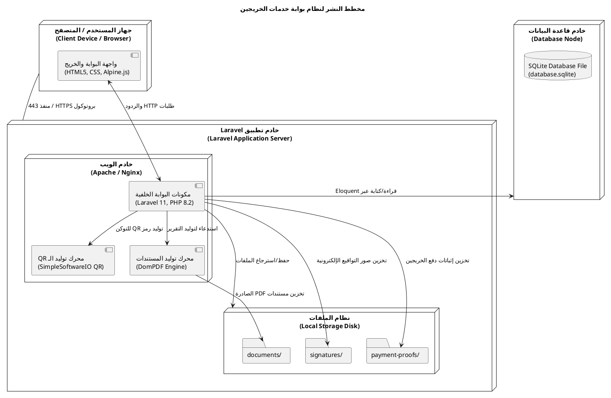
